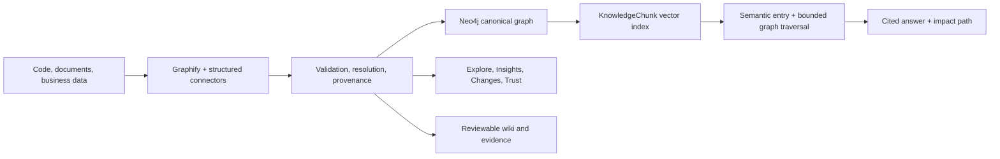

# Ontology Atlas

Ontology Atlas is a local, read-only **enterprise knowledge and impact-analysis
accelerator**. It combines code, documents, and structured business data in Neo4j so a
decision-maker can ask a question, see the affected systems, and inspect the evidence
behind every answer.

The package name and `ontology-agent` CLI remain compatible with existing projects.

## The business outcome

Ontology Atlas turns fragmented technical and business knowledge into five client-facing
workspaces:

- **Ask** — cited Neo4j GraphRAG answers with an impact path and evidence drawer.
- **Explore** — one graph with All, Architecture, and Business data layers.
- **Insights** — hotspots, surprising links, and community cohesion.
- **Changes** — additions, removals, and modified graph elements between runs.
- **Trust** — source coverage, evidence tiers, rejected assertions, index freshness, and
  golden-question evaluation.

There is one canonical graph. Neo4j stores it; Explore presents it; Ask retrieves from it.
Graphify's `graph.html` is disabled because it duplicated the product surface and became
resource-heavy on large graphs. `GRAPH_TREE.html` and `GRAPH_REPORT.md` remain available as
secondary diagnostics.

## Architecture



Knowledge chunks are deterministic and linked to canonical entities and source spans with
`ABOUT` and `SUPPORTED_BY`. The official Neo4j GraphRAG `VectorCypherRetriever` performs
semantic entry-point retrieval followed by fixed, read-only traversal. User questions never
become Cypher.

## Prerequisites and installation

- Python 3.12+
- Neo4j 5.18.1+
- OpenAI API access for extraction, embeddings, and answer generation
- UV (recommended)

```bash
git clone <repository-url>
cd ontology_atlas
uv tool install --force '.[rag]'
ontology-agent --help
```

For local development:

```bash
uv sync --extra dev --extra rag
```

## Create and run a client project

```bash
ontology-agent init client-atlas \
  --target /path/to/client/.ontology-agent \
  --source /path/to/client \
  --source-profile code-docs \
  --with-markdown-wiki

cd /path/to/client/.ontology-agent
cp .env.example .env
```

Set Neo4j and OpenAI credentials in `.env`, then enable GraphRAG in `project.yaml`:

```yaml
llm:
  provider: openai
embedding:
  provider: openai
  dimension: 1536
rag:
  enabled: true
  top_k: 8
  max_hops: 2
```

Run the answer-first workflow:

```bash
ontology-agent run --neo4j
ontology-agent rag index
ontology-agent portal build --neo4j
ontology-agent rag status
ontology-agent portal serve
```

Open `http://127.0.0.1:8765/portal/index.html`. `explore.html` also works offline; live
answers require `portal serve`.

## Ten-minute demo script

1. **Minute 0–2 — Ask:** “Which systems are affected if Customer Profile changes?”
2. **Minute 2–4 — Prove it:** expand citations, compare authoritative structured facts with
   extracted claims, and show the relationship path.
3. **Minute 4–6 — Explore:** switch between Architecture and Business data without changing
   graph products.
4. **Minute 6–8 — Assess impact:** select a node and run “What depends on this?”
5. **Minute 8–9 — Show change:** open Changes to explain what moved since the last run.
6. **Minute 9–10 — Establish trust:** open Trust and show coverage, index freshness, and the
   golden-question score.

The complete scripted build can be run with `ontology-agent demo`. When GraphRAG is enabled,
it publishes, indexes, builds the portal, and runs the three flagship questions.

## Evaluation

Edit `rag/questions.yaml` with accepted entities, source paths, and explicit no-answer cases:

```bash
ontology-agent rag evaluate
ontology-agent portal build --neo4j
```

The report measures citation validity, expected-entity retrieval, expected-source retrieval,
unsupported-answer refusal, latency, and per-question failures. Trust displays the saved result.

## Cost-bearing steps

- A first full Graphify/OpenAI extraction consumes LLM tokens.
- `rag index` embeds only new or content-changed knowledge chunks.
- Each supported `rag ask` call performs retrieval plus one answer-generation call.
- Incremental Graphify updates avoid a full re-extraction when possible.
- Portal building, offline Explore, Changes, Trust rendering, and graph traversal in the browser
  do not call an LLM.

## Explicit v1 limitations

- Local, single-project, read-only demo bound to `127.0.0.1` by default.
- No authentication, tenancy, hosted deployment, MCP, or unrestricted Text2Cypher.
- OpenAI is the supported GraphRAG embedding and generation provider in v1.
- Golden questions are project-specific and must be curated before presenting scores.
- Neo4j is required for live answers; the static Explore surface remains available without it.

## Development gates

```bash
uv run --extra dev --extra rag pytest
uv run --extra dev --extra rag ruff check .
uv run --extra dev --extra rag mypy src/company_ontology_agent
uv run --extra dev --extra rag mkdocs build --strict
uv build
```

See [the CLI reference](docs/reference/cli.md),
[GraphRAG architecture](docs/architecture/graph-rag.md), and
[portal architecture](docs/architecture/portal.md) for operational detail.

MkDocs builds the documentation into `site/`; that generated directory is ignored and should
not be committed. Publish from source with a `gh-pages` workflow or an equivalent docs host.
