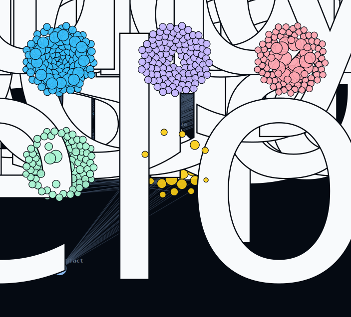
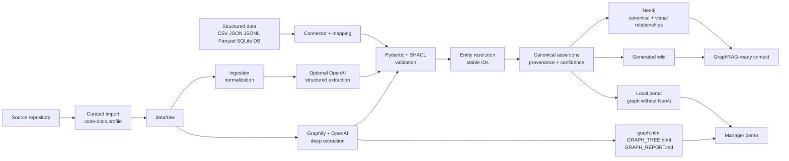

# Company Ontology Suite

Company Ontology Suite is a local-first Python package that turns a repository into
a Graphify-powered ontology asset: curated knowledge graph, Neo4j demo graph,
generated markdown wiki, local visual portal, and GraphRAG-ready graph + wiki artifacts.

The package is installable with UV and exposes the `ontology-agent` CLI.



<sub>The portal's data-graph view (exported straight from the portal as SVG). Nodes are
clustered by community/type and ranked by importance; the live page adds search across every
entity, click-through evidence, a Graphify intelligence dashboard, and a run-to-run Changes
diff. Run `ontology-agent portal serve` to explore it interactively.</sub>

## What It Produces

- Graphify/OpenAI source graph and reports.
- Validated ontology graph with provenance and confidence.
- Neo4j-ready canonical graph plus curated entity-to-entity visual relationships.
- Markdown wiki with architecture, data, deployment, API, module, and GraphRAG pages.
- Local static portal: data graph, repo graph, a Graphify intelligence dashboard
  (hotspots, surprising links, refactor candidates, suggested questions, data quality),
  and a Changes tab that diffs each run against the last.
- Progressive re-runs: incremental `graphify update` (no LLM cost) with run-to-run diffs.
- Optional structured business-data graphs from CSV, JSON/JSONL, SQLite, and
  PostgreSQL/Aurora-style connectors through mapping files.

## Architecture



## Install

Recommended one-line install after cloning the repo:

```bash
cd /Users/yureeh/Documents/ontology_atlas
uv tool install --force .
ontology-agent --help
```

For projects with Parquet datasets:

```bash
uv tool install --force '.[parquet]'
```

Equivalent local shortcut:

```bash
make install
```

If UV warns that `~/.local/bin` is not on `PATH`, run this once and restart the shell:

```bash
uv tool update-shell
```

Equivalent install from a wheel or GitLab artifact:

```bash
uv tool install --force company_ontology_agent-0.1.0-py3-none-any.whl
```

Pip also works inside an activated virtualenv:

```bash
pip install .
ontology-agent --help
```

For a global CLI using the pip ecosystem, use `pipx`:

```bash
pipx install .
```

Use `uv sync --extra dev` only when developing this package or running its quality gates.
Full macOS, Linux, and Windows install notes are in
[`docs/getting-started/install.md`](docs/getting-started/install.md).

## Quickstart

Create a project-local ontology instance from a real repository:

```bash
ontology-agent init ontology-atlas-oracle-bets \
  --target /Users/yureeh/dev/oracle_bets/.ontology-agent \
  --source /Users/yureeh/dev/oracle_bets \
  --source-profile code-docs \
  --with-markdown-wiki \
  --force

cd /Users/yureeh/dev/oracle_bets/.ontology-agent
cp .env.example .env
```

Fill `.env` with OpenAI and Neo4j credentials when available. Neo4j is optional for
local graph viewing.

## Daily Commands

The full command guide is [docs/reference/cli.md](docs/reference/cli.md). Generated
projects also include the same daily workflow in their local `README.md`.

```bash
make check          # dry-run graph, wiki, and portal; no Neo4j write
make portal         # rebuild local portal from dry-run graph
make view           # serve local portal
make demo-dry-run   # full local demo without Neo4j
make publish        # write canonical graph to Neo4j and export wiki/portal
make publish-prune  # publish and mark missing generated nodes stale
make demo           # full manager demo path with Neo4j
make wiki           # re-export wiki from Neo4j
```

Use `make reset-neo4j` only when you intentionally want to clear the configured local
Neo4j database for a clean PoC run.

Structured dataset commands:

```bash
ontology-agent data sample-template data_reply
ontology-agent data inspect
ontology-agent data build-graph --dry-run
```

## Additive Updates

Normal Neo4j publishing is additive and idempotent. Stable IDs plus Cypher `MERGE`
update existing nodes/relationships and add new ones, so regular codebase additions do
not require deleting the graph. Use `make publish` after importing or refreshing source
files.

Dry-run mode refreshes the local JSON snapshot so validation reflects the current
project state. For deletions and major renames, use safe pruning:

```bash
ontology-agent run --neo4j --prune stale
ontology-agent graph prune --mode stale
ontology-agent graph prune --mode delete --yes
```

`stale` marks missing generated nodes/relationships as superseded. `delete` is
destructive and requires `--yes`.

## Visualization

The default graph viewing path is the generated portal:

```bash
make check
make view
```

Open `portal/index.html` to inspect the evidence-first graph without Neo4j. The portal is
three pages that share one renderer: `index.html` (the default structured-data graph),
`repo.html` (the code/architecture graph), and `intelligence.html` (a Graphify dashboard
of architecture hotspots, surprising connections, and community cohesion). Each page
inlines only a bounded, ranked subset of nodes and links to the full `portal/graph.json`,
so the HTML stays small and opens offline. Structured connector relationships are labelled
as authoritative; Graphify/OpenAI semantic relationships show evidence, confidence tier,
extractor, and source path. The portal also links to Graphify artifacts such as
`graphify-out/graph.html`, `GRAPH_TREE.html`, and `GRAPH_REPORT.md` when they exist.

Neo4j remains the canonical backend for real graph writes. Published graphs include
`DemoNode` labels, captions, direct `DemoProject -> DemoNode` links, and curated
entity-to-entity relationships. In Neo4j Explore, click `DemoNode` for a no-query view.
If Explore still shows only `Project`, `Source`, or `SourceSpan` dots, run query 1 from
`graph/explore.cypher`. Those labels are provenance nodes; the curated graph
intentionally excludes them.

## Documentation Site

MkDocs builds the documentation into `site/`. That folder is generated output, ignored
by git, and should not be committed.

```bash
uv run --extra dev mkdocs serve
uv run --extra dev mkdocs build --strict
```

For publishing, use `gh-pages` or a dedicated GitHub Pages workflow that builds the
site from source docs. Do not commit generated HTML.

## Quality Gates

CI and local pre-commit are aligned around:

```bash
uv sync --extra dev
uv run --extra dev pytest
uv run --extra dev ruff check .
uv run --extra dev mypy src/company_ontology_agent
uv run --extra dev mkdocs build --strict
uv build
```

Local shortcut:

```bash
make check
```

Install local hooks with:

```bash
uv run --extra dev pre-commit install
```

The pre-commit hook runs the fast checks. Run the full gate above before publishing or
opening a release PR.
