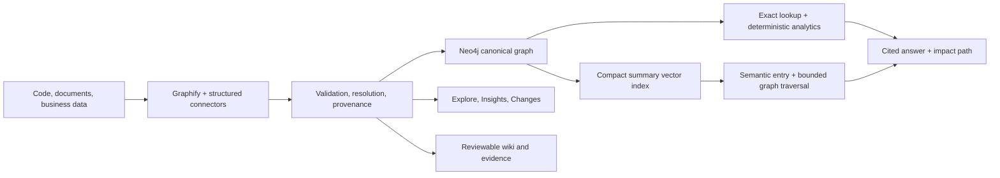

# Ontology Atlas

Ontology Atlas is a local, read-only **enterprise knowledge and impact-analysis
accelerator**. It combines code, documents, and structured business data in Neo4j so a
decision-maker can ask a question, see the affected systems, and inspect the evidence
behind every answer.

The package name and `ontology-agent` CLI remain compatible with existing projects.

## The business outcome

Ontology Atlas turns fragmented technical and business knowledge into four client-facing
workspaces:

- **Ask** — cited Neo4j GraphRAG answers with an impact path and evidence drawer.
- **Explore** — one graph with All, Architecture, and Business data layers.
- **Insights** — measured impact hotspots, cross-area dependencies, lineage, and gaps.
- **Changes** — compatible-baseline change and impact analysis grouped for decisions.

There is one canonical graph. Neo4j stores it; Explore presents it; Ask retrieves from it.
The generated `graphify-out/graph.html` is a concise code-and-document community map;
`graph.raw.html` preserves Graphify's dense original. Neither contains structured business data
or replaces the fused canonical graph.

## Architecture



Knowledge chunks are deterministic summaries linked to canonical entities and source spans.
Exact facts and supported aggregations use fixed parameterized queries first. Semantic questions
use Neo4j GraphRAG retrieval. On loopback only, an official Text2Cypher planner may propose a
query when deterministic analytics cannot express the request; Atlas validates, explains, bounds,
project-scopes, and executes it through a read transaction itself.

## Prerequisites and installation

- Python 3.12+
- Neo4j 5.18.1+
- OpenAI API access for extraction, embeddings, and answer generation
- UV (recommended)

```bash
git clone <repository-url>
cd ontology_atlas
uv tool install --force '.[rag]'
ontology-agent --help
```

For local development:

```bash
uv sync --extra dev --extra rag
```

## Create and run a client project

```bash
ontology-agent init client-atlas \
  --target /path/to/client/.ontology-agent \
  --source /path/to/client \
  --source-profile code-docs \

cd /path/to/client/.ontology-agent
cp .env.example .env
```

Set Neo4j and OpenAI credentials in `.env`, then enable GraphRAG in `project.yaml`:

```yaml
llm:
  provider: openai
embedding:
  provider: openai
  dimension: 1536
rag:
  enabled: true
  top_k: 4
  max_hops: 2
  analytics:
    enabled: true
    text2cypher_local: true
    max_hops: 3
    max_rows: 100
    timeout_seconds: 5
```

Run the complete answer-first workflow:

```bash
ontology-agent launch
```

This validates configuration, incrementally extracts knowledge, loads business data, validates
and resolves the graph, publishes it to Neo4j, incrementally indexes retrieval summaries, builds
the workspace, and serves it. Use `ontology-agent launch --no-serve` in CI. Generated projects
also provide `make start` as a Neo4j-aware wrapper.

Open `http://127.0.0.1:8765/portal/index.html`. `explore.html` also works offline; live
answers require `portal serve`.

## Ten-minute demo script

1. **Minute 0–2 — Ask:** “Which systems are affected if Customer Profile changes?”
2. **Minute 2–4 — Prove it:** expand citations, compare authoritative structured facts with
   extracted claims, and show the relationship path.
3. **Minute 4–6 — Explore:** switch between Architecture and Business data without changing
   graph products.
4. **Minute 6–8 — Assess impact:** select a node and run “What depends on this?”
5. **Minute 8–9 — Show change:** open Changes to explain what moved since the last run.
6. **Minute 9–10 — Prove quality:** show the golden-question evaluation with citation,
   retrieval, refusal, and latency results.

Use `ontology-agent launch --no-serve` to perform the same build without starting the server.

## Evaluation

Edit `rag/questions.yaml` with expected entities, source paths, relationship paths, and explicit
no-answer cases. It contains expectations only—never scripted answers:

```bash
ontology-agent rag evaluate
ontology-agent portal build --neo4j
```

The report measures citation validity, expected-entity retrieval, expected-source retrieval,
unsupported-answer refusal, latency, and per-question failures, then saves the detailed result.

## Cost-bearing steps

- A first full Graphify/OpenAI extraction consumes LLM tokens.
- `rag index` embeds only new or content-changed knowledge chunks.
- Each supported `rag ask` call performs retrieval plus one answer-generation call.
- Incremental Graphify updates avoid a full re-extraction when possible.
- Portal building, offline Explore, Changes rendering, and graph traversal in the browser
  do not call an LLM.

## Explicit v1 limitations

- Local, single-project, read-only demo bound to `127.0.0.1` by default.
- No authentication, tenancy, hosted deployment, MCP, or public/unrestricted Text2Cypher.
- OpenAI is the supported GraphRAG embedding and generation provider in v1.
- Golden questions are project-specific and must be curated before presenting scores.
- Neo4j is required for live answers; the static Explore surface remains available without it.

## Development gates

```bash
uv run --extra dev --extra rag pytest
uv run --extra dev --extra rag ruff check .
uv run --extra dev --extra rag mypy src/company_ontology_agent
uv run --extra dev --extra rag mkdocs build --strict
uv build
```

See [the CLI reference](docs/reference/cli.md),
[GraphRAG architecture](docs/architecture/graph-rag.md), and
[portal architecture](docs/architecture/portal.md) for operational detail.

MkDocs builds the documentation into `site/`; that generated directory is ignored and should
not be committed. Publish from source with a `gh-pages` workflow or an equivalent docs host.
